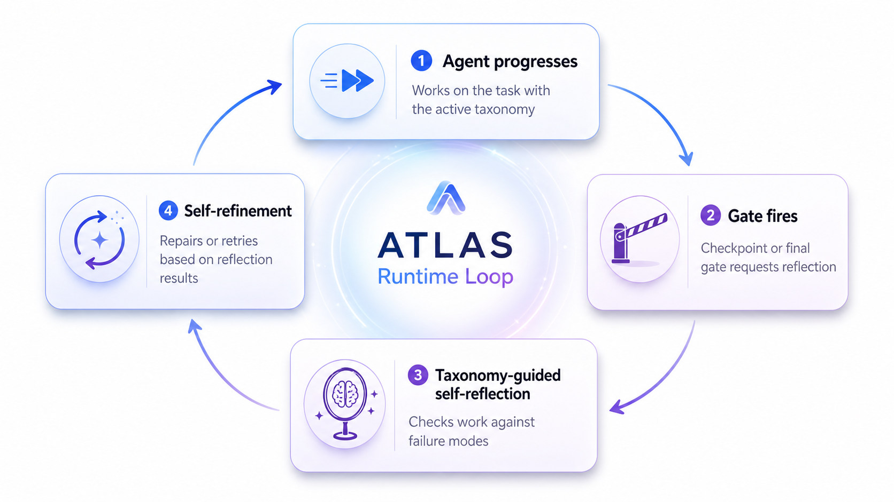
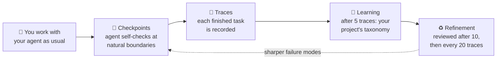
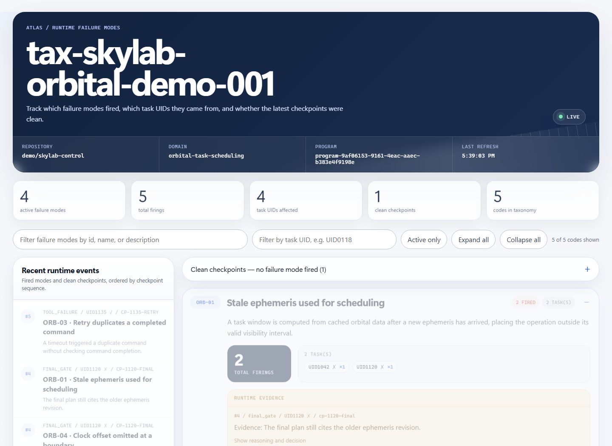

# AdaMAST

<p align="center">
  <b>Your agent keeps making the same mistakes. AdaMAST learns what they are — from your agent's own work — and reminds it at the right moments.</b>
</p>

<p align="center">
  <a href="https://arxiv.org/abs/2607.16387"></a>
  <a href="https://multi-agent-systems-failure-taxonomy.github.io/AdaMAST/docs/"></a>
  <a href="https://www.python.org/"></a>
  <a href="LICENSE"></a>
</p>

<p align="center">
  <br>
</p>

**AdaMAST** rides along with the agent you already use — Codex, Claude Code, or your own harness. While the agent works, AdaMAST quietly checks the work at natural boundaries, records evidence when something goes wrong, and — after enough completed tasks — **learns a failure-mode catalog (a "taxonomy") specific to your project**. From then on, the agent is checked against *its own* known weaknesses instead of a generic list.

**Paper:** [Fantastic Adaptive Taxonomies and How to Use Them](https://arxiv.org/abs/2607.16387) · **Docs:** [Website](https://multi-agent-systems-failure-taxonomy.github.io/AdaMAST/docs/)

---

## 🚀 Quickstart (zero configuration)

Requirements: Python 3.10+ and Codex or Claude Code.

```bash
pip install adamast
```

Then register AdaMAST with the host you use (once):

```bash
# Claude Code
adamast claude install --user-level

# Codex
adamast codex install --user-level
```

Fully quit and reopen Codex / Claude Code, then start a **new conversation**. That's it — no config file, no extra API key, no second login.

On your first message, AdaMAST opens its taxonomy picker and asks one question — where should this conversation start from?

| Choice | What it means |
|---|---|
| 🧭 **MAST** *(recommended at first)* | Start from the built-in 14 general failure modes. After **5 completed tasks**, AdaMAST automatically learns a taxonomy specific to your project. |
| 📚 **A stored taxonomy** | Reuse a taxonomy your project already learned. |
| 🚫 **No taxonomy** | AdaMAST stays completely out of this conversation. |

Pick with one click (or one number in a terminal) — your held message then continues automatically.

> 💡 **Check it worked:** run `adamast doctor` any time. It validates your install and tells you exactly what to do if something is off.

## 🔄 What happens while you work



1. **You work normally.** AdaMAST never takes over the task.
2. **At checkpoints** (finishing a sub-task, a failed tool, the final answer) the agent privately asks itself: *what just happened, what caused it, does a known failure mode apply, continue or repair?* Finding nothing wrong is a perfectly valid answer.
3. **Each completed task becomes a trace.** Traces are the raw material for learning.
4. **At 5 traces, learning kicks in** — a background worker drafts a taxonomy of *your* project's actual failure patterns, with verbatim evidence for every code. A separate reviewer must approve it before it activates. Your conversation never waits.
5. **It keeps improving.** The taxonomy is reviewed against new traces after 10 more, then every 20.

Watch it live: `adamast dashboard` opens a local monitor showing every checkpoint, the evidence behind it, and which failure modes fired.

<p align="center">
  
</p>

## 🎛️ Make it yours

Everything above ran on defaults. Each step has one obvious knob when you want a custom setup:

| I want to… | Do this instead |
|---|---|
| Enable AdaMAST for **one repository** only | `adamast claude install --project-dir .` (same for `codex`) · [Getting started](docs/GETTING_STARTED.md) |
| Start every conversation from a taxonomy I already trust | `--inherit <taxonomy-id>` at install · [Taxonomies](docs/TAXONOMIES.md) |
| Learn faster / slower | `--generation-threshold N` (default 5), `--k-init N` (10), `--k N` (20) |
| Freeze the taxonomy (no more learning) | `--freeze` |
| Use a provider API for learning instead of native subagents | `--learning-backend provider --adamast-model <model>` · [Providers](docs/PROVIDERS.md) |
| Build a taxonomy from traces I already have | `adamast import-traces --traces ./my_traces` · [Trace formats](docs/TRACE_FORMATS.md) |
| Wrap a single LLM call instead of a whole host | `adamast single-run` · [Single LLM](docs/SINGLE_LLM.md) |
| Put AdaMAST inside my own agent loop | `from adamast import start_session` · [Runtime API](docs/INTEGRATION.md) |

Every field, flag, and default lives in the [Configuration reference](docs/CONFIGURATION.md); deeper customization (prompts, gates, custom hooks) in [Customization](docs/CUSTOMIZATION.md).

## 🧠 Why adaptive taxonomies?

Improvement needs feedback that preserves *why* something failed. Scalar rewards throw the reason away; free-form reflection doesn't aggregate; a fixed catalog can't know your agent's roles, tools, or domain in advance. AdaMAST learns a compact, evidence-grounded failure vocabulary from the target system's own traces — starting from the built-in 14-code adaptation of MAST (["Why Do Multi-Agent LLM Systems Fail?"](https://arxiv.org/abs/2503.13657), Cemri et al., 2025) until the first learned taxonomy activates.

Learned codes are organized on three stable axes:

| Axis | Scope | Example |
|---|---|---|
| ⚙️ System-level | Can arise in any agent system | Context exhaustion |
| 🎭 Role-specific | Tied to a discovered component role | Checker rubber-stamps solver output |
| 🧪 Domain-specific | Requires task knowledge | Algorithm mismatch |

## 🏆 Results

| Experiment | Headline |
|---|---|
| [OfficeQA Pro](runs/OfficeQA/) | 44.4% → **51.9%** official scorer, same 133-question harness in both arms |
| [Circle packing, n=26](runs/Circle-Packing/) | AdaMAST-guided search reaches **0.997×** the AlphaEvolve record in 20 evaluations |
| TRAIL (paper) | Induced codes align with expert annotations at Cohen's κ **0.725** |
| Terminal-Bench 2.0 (paper) | AdaMAST-Judge at **89.9%** accuracy |
| Evolutionary optimization, 655 problems (paper) | **87.9% → 91.9%** held-out improvement |

Summaries, exact taxonomies, and reproduction notes live in [`runs/`](runs/). Per-question rows and raw scorer output are not included, so the headline numbers cannot be independently recomputed from this repository alone.

## 📚 Learn more

| You want to… | Read |
|---|---|
| Do the first install, step by step | [Interactive setup](docs/INTERACTIVE_SETUP.md) |
| See one complete run end to end | [Example run](docs/EXAMPLE_RUN.md) |
| Understand the words (gate, trace, taxonomy, …) | [Concepts](docs/CONCEPTS.md) |
| Understand how learning stays safe & race-free | [Native taxonomy learning](docs/NATIVE_LEARNING.md) |
| Fix a broken setup | [Troubleshooting](docs/TROUBLESHOOTING.md) |
| Browse everything | [Documentation index](docs/README.md) |

<details>
<summary><b>🧰 All commands</b></summary>

| Command | Purpose |
|---|---|
| `adamast doctor` | Validate paths, configuration, hooks, and host contracts |
| `adamast status` | Show the active taxonomy, traces, learning state, recent decisions |
| `adamast find` | List or select stored taxonomies |
| `adamast dashboard` | Open the local taxonomy dashboard / checkpoint monitor |
| `adamast traces` | Inspect trace state |
| `adamast import-traces` | Generate a taxonomy from existing traces |
| `adamast claude install` / `uninstall` | Manage Claude Code hooks |
| `adamast codex install` / `uninstall` | Manage Codex hooks |
| `adamast single-run` | Wrap one direct model task with AdaMAST |

</details>

<details>
<summary><b>🗂️ Repository map</b></summary>

| Path | Responsibility |
|---|---|
| [`adamast/core/`](adamast/core/) | Taxonomy data model, evidence, traces, reflection parsing, taxonomy store/MAST/resolution, session lifecycle |
| [`adamast/protocol/`](adamast/protocol/) | The one compact-checkpoint implementation and the pre-submission gate |
| [`adamast/judges/`](adamast/judges/) | Taxonomy and reflection judges, plus the provider-neutral JUDGES contract |
| [`adamast/llm/`](adamast/llm/) | Model routing, learning calls, and provider transports |
| [`adamast/learning/`](adamast/learning/) | Taxonomy generation and refinement, learning jobs, and the vendored/ported pipelines |
| [`adamast/hosts/`](adamast/hosts/) | Claude Code, Codex, interactive, and single-LLM host adapters |
| [`adamast/dashboard/`](adamast/dashboard/) | Local dashboard, status, taxonomy viewer, and web views |
| [`adamast/cli.py`](adamast/cli.py) | The umbrella `adamast` command |
| [`tests/`](tests/) | The single test suite (`python -m pytest tests`) |
| [`docs/`](docs/) | User and contributor documentation ([index](docs/README.md)) |
| [`adamast/examples/`](adamast/examples/) | Runnable demonstrations (`python -m adamast.examples` copies them locally) |
| [`runs/`](runs/) | Evaluation artifacts and reproduction notes |
| [`scripts/`](scripts/) | Repository tooling: docs-site build, public publishing |
| [`website/`](website/) | The static landing page served ahead of the docs |
| [`SKILL.md`](SKILL.md) | The Codex skill manifest for AdaMAST |

Everything importable lives in the `adamast` package; the complete ownership
rules are in [Architecture](docs/ARCHITECTURE.md).

</details>

## 🤝 Contributing

Development setup, verification commands, and package boundaries: [CONTRIBUTING.md](CONTRIBUTING.md) · Release steps: [RELEASING.md](RELEASING.md)

The original research pipeline lives on the
[`paper-pipeline`](https://github.com/multi-agent-systems-failure-taxonomy/ATLAS/tree/paper-pipeline)
branch; a maintained, locally patched fork is vendored under
[`adamast/learning/vendor/`](adamast/learning/vendor/) with provenance in
[`VENDORED.md`](adamast/learning/vendor/VENDORED.md).

## 📄 License

Apache-2.0. See [LICENSE](LICENSE).
