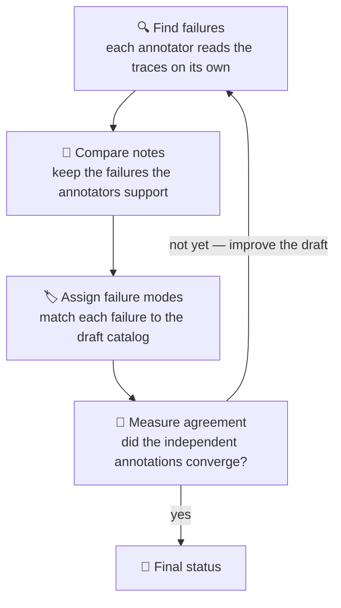

# Inter-annotator agreement gate

This page explains how a drafted taxonomy earns the `accepted` status — and how
to tune and audit that decision.

The agreement layer tests whether the drafted taxonomy is operational: can
multiple annotators independently find the same failures and choose the same
codes from the trace evidence?

## 🤔 Why the gate exists

A plausible-looking list of failure modes can still contain overlapping,
ambiguous, or unobservable definitions. AdaMAST therefore separates drafting
from validation. The generated taxonomy is marked `accepted` only after the
agreement and coverage thresholds both pass.

## 👥 The four annotators

Each round uses four independent annotator memories: Alpha, Beta, Gamma, and
Delta. They begin from the same instructions but make separate calls and retain
their own prior annotations.

!!! note
    This is an LLM inter-annotator process, not four human labels and not a
    majority vote over one shared response.

## 🔁 One agreement round



1. **Find failures.** Each annotator reads the sampled traces independently
   and marks what went wrong — including failures the current draft has no
   entry for.
2. **Compare notes.** The findings are merged; only failures supported across
   annotators move forward.
3. **Assign failure modes.** Each supported failure is matched — again
   independently — to the draft's failure modes.
4. **Measure agreement.** AdaMAST checks how well the independent assignments
   converged and how much of what was found the draft covers. If either falls
   short, the weak definitions are rewritten and another round runs.

## 📏 Acceptance metrics

| Metric | Default target | What it measures |
| --- | ---: | --- |
| Macro Fleiss kappa over used codes | `0.75` | Agreement beyond chance on whether each used code applies |
| Error coverage | `0.70` | Fraction of reconciled errors covered by the taxonomy |
| Maximum rounds | `5` | Bound on refinement work |

!!! tip "Make it yours"
    The defaults are configured with `--kappa-target`, `--coverage-floor`, and
    `--max-rounds`; pass `--no-early-stop` to force every configured round.

## ⏱️ Early stopping

By default, the controller can stop when recent rounds show stable target-level
agreement and sufficient coverage, or when additional rounds are no longer
improving the result. Pass `--no-early-stop` to force every configured round.

!!! note
    Early stopping affects the amount of iteration, not the acceptance rule.
    Final status is still computed from the final kappa and coverage values.

## 🚦 Accepted versus review required

### `accepted`

Both final metrics meet their configured thresholds. The taxonomy can be used
by the judge without an override.

### `review_required`

At least one final metric missed its threshold. AdaMAST still writes the draft,
final candidate, annotations, per-round measurements, and browser view so a
researcher can inspect what failed.

!!! warning
    The judge rejects this status by default. `--allow-review-required`
    exists for explicit experiments, but it is not equivalent to passing the
    gate.

## 🔎 Audit the result

Open `manifest.json` and inspect:

```json
{
  "status": "accepted",
  "acceptance": {
    "kappa_metric": "macro Fleiss kappa over used codes",
    "kappa_target": 0.75,
    "coverage_floor": 0.70,
    "final_kappa": 0.81,
    "final_coverage": 0.76,
    "passed": true
  }
}
```

The `artifacts/agreement/` directory contains the detailed round outputs needed
to investigate confusion between codes or insufficient coverage. See
[Outputs and field guide](TAXONOMY_OUTPUTS.md) for the complete directory map.

## ⚖️ Change thresholds carefully

- Keep thresholds fixed across runs when comparing systems.
- Record overrides in experiment configuration, not only in a shell history.
- Do not lower thresholds only because a particular result failed.
- Compare the evidence and low-agreement codes before adding more rounds.
- Treat kappa and coverage as complementary: high agreement can coexist with a
  taxonomy that consistently misses errors.

## ➡️ Continue with

- [Outputs and field guide](TAXONOMY_OUTPUTS.md) — where the per-round
  agreement artifacts land on disk.
- [Judge traces](JUDGING.md) — use the accepted taxonomy.
