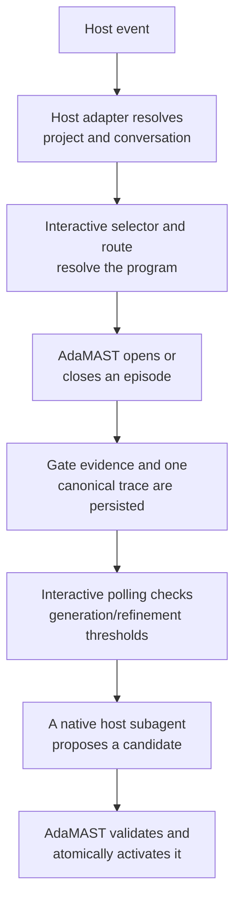

# Architecture

Learn how AdaMAST is laid out, how a host event flows through the runtime, and
the rules that keep taxonomy state safe. AdaMAST separates the taxonomy engine
from the places where agents run, which keeps Codex, Claude Code, scripts, and
custom harnesses on one trace and activation contract.

## 🗺️ Repository map

| Path | Owns | Does not own |
|---|---|---|
| `adamast/core/` | Taxonomy data model, evidence, trace persistence, reflection parsing, taxonomy store/MAST/resolution, session lifecycle | Host hook formats |
| `adamast/protocol/` | The compact-checkpoint transport (parser, citation matching, repair heuristic) and the pre-submission gate | Host event handling |
| `adamast/judges/` | Selection, mapping, coverage, quality, calibration, and reflection judges plus the provider-neutral JUDGES contract | Host orchestration |
| `adamast/llm/` | Model routing, learning calls, provider transports | Judge policy |
| `adamast/learning/` | Generation/refinement lifecycle, learning jobs and worker contract, vendored and ported generation pipelines | Interactive hooks |
| `adamast/hosts/interactive/` | Conversation selector, browser transport, project/task-group routes | Codex or Claude transcript parsing |
| `adamast/hosts/codex/` | Codex hook installation, event translation, transcript normalization, compact Stop checkpoint | Taxonomy acceptance |
| `adamast/hosts/claude_code/` | Claude hook installation, blocking gates, transcript handling, custom hooks | Taxonomy acceptance |
| `adamast/hosts/single_llm/` | One direct model task wrapped with checkpoints, the final gate, and trace recording | Host hook installation |
| `adamast/dashboard/` | Local dashboard, status, taxonomy viewer, selector web views | Learning policy |
| [`adamast/examples/`](https://github.com/multi-agent-systems-failure-taxonomy/AdaMAST/tree/main/adamast/examples) | Runnable demonstrations | Production state |

Everything importable lives in the single `adamast` package; judge-focused
evaluation checks live in `tests/test_judge_surface.py`.

## 🔁 Runtime flow



The main agent always owns the user's task. The taxonomy worker receives an
immutable outcome-blind snapshot and cannot edit the taxonomy store. This
separation lets learning continue in parallel without giving a background
worker activation authority.

## 🏠 Durable project scope

User-level Codex and Claude installs resolve the canonical Git root and store
program state under:

```text
~/.adamast/interactive/
  projects/<project-key>/
    groups/<host>-branch-<conversation-hash>/
      program/
```

The project key includes a canonical-path hash, so unrelated repositories with
the same folder name remain isolated. Automatic routing includes the host and
stable conversation ID in the branch identity. A stored taxonomy or MAST is a
seed, not a shared mutable default; every selected conversation receives its
own trace queue, counters, learning job, and taxonomy head.

Host ownership and conversation binding follow four rules:

- Host ownership is enforced again at program claim, selector choice, taxonomy
  activation, and native-job claim.
- Provider-neutral imported taxonomies can seed either host. A taxonomy
  generated by one interactive host is not selectable by the other; records
  with contradictory host provenance are treated as mixed and are selectable
  by neither.
- The first resolved program path is bound to the host's stable conversation
  ID. Subsequent events use that binding before inspecting `cwd`, which keeps
  a resumed conversation on the same taxonomy even after a shell or directory
  change.
- On upgrade, AdaMAST locates an existing selected or disabled session and
  writes the binding before it can create a new pending selector.

## 🧱 Stability rules

- Host adapters preserve their documented import and CLI paths.
- Taxonomy activation occurs only in the foreground coordinator.
- One conversation branch has at most one active learning job.
- The active taxonomy remains stable while learning runs.
- Invalid or stale candidates leave the current taxonomy unchanged.
- Generated taxonomy IDs are immutable; `display_name` is the user-facing name.
- One taxonomy version may have several child versions, one per refining
  conversation branch; there is no global "latest" child after a split.

## ➡️ Continue with

- [Native taxonomy learning](NATIVE_LEARNING.md): the job state machine.
- [Custom agent harness](INTEGRATION.md): the runtime API the hosts sit on.
