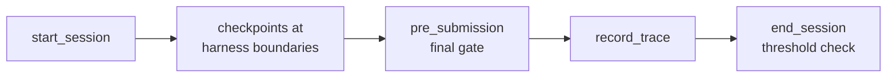

# Adaptive runtime overview

This page upgrades AdaMAST from a one-shot generator to an adaptive runtime:
a taxonomy stays active while your agent works, each completed task is
recorded as a [trace](TRACE_FORMATS.md#what-counts-as-a-trace), and learning
starts by itself as evidence accumulates.

!!! tip "Only need a fixed taxonomy and a judge?"
    Complete the standalone [Foundation](GENERATION.md) and
    [Evaluation](JUDGING.md) guides first; they may be all you need.

## ⚙️ Install and configure

1. Install the package as described on the
   [documentation home](index.md#install-adamast).

2. Create `adamast.json` in the project using the runtime:

    ```json
    {
      "version": 1,
      "trace_output": "./adamast-program",
      "adamast_model": "gpt-5"
    }
    ```

3. Verify the runtime configuration:

    ```bash
    adamast doctor --config adamast.json
    ```

    Relative paths are resolved from the config file. Unknown fields fail
    loudly.

The two fields:

| Field | Meaning |
|---|---|
| `trace_output` | Identifies **one learning stream**. Reusing it means the active taxonomy, pending traces, and counters are shared; use a different path when two task streams must learn independently. |
| `adamast_model` | The model used for generation, judging, and refinement. It is separate from the model used by the task-solving agent. |

!!! note
    Codex and Claude Code perform this separation automatically: every new
    interactive conversation is routed to its own conversation branch beneath
    the project root. Custom harnesses must choose their own `trace_output`
    boundary.

Every threshold, storage path, learning mode, and checkpoint option is listed
in the [configuration reference](CONFIGURATION.md).

## 🔁 What changes at runtime

| Standalone workflow | Adaptive runtime |
| --- | --- |
| You provide a finished trace dataset | The integration records one canonical trace per completed task or episode |
| Generation runs when you invoke it | Generation/refinement runs when configured trace thresholds are reached |
| `taxonomy.json` is a file you select | A program tracks its active taxonomy and successor lineage |
| Judging is a separate batch call | Checkpoints, including the final gate, can apply taxonomy guidance during work |
| No persistent counters | Pending traces, generation state, and refinement counters persist |

## 🧩 Choose an integration surface

| Your situation | Use |
|---|---|
| A script, notebook, benchmark runner, or batch job owns the model call and can set task boundaries explicitly | [Single-LLM integration](SINGLE_LLM.md) |
| An application owns agent events, tool boundaries, and transcript capture, and can call the runtime API at session start, checkpoints, final submission, and trace commit | [Custom agent harness](INTEGRATION.md) |
| You work inside Codex or Claude Code | [Codex](CODEX.md) or [Claude Code](CLAUDE_CODE.md): host-specific hooks, selector behavior, event contracts, and uninstall steps |

## 🐍 Minimal runtime lifecycle

One session, from start to learning check:



```python
from adamast import (
    GenerationTrace,
    end_session,
    pre_submission,
    record_trace,
    start_session,
)

session = start_session(
    trace_output="./adamast-program",
    adamast_model="gpt-5",
)

# Deliver session.delivery.runtime_protocol at task start.
# Invoke checkpoint handling at boundaries owned by your harness.

# gate_text is the agent's candidate final response, produced by your harness.
decision = pre_submission(session, gate_text)
if not decision.allow:
    # Ask the agent to repair or re-emit the required final-gate response.
    pass

record_trace(
    session,
    GenerationTrace(
        problem_id="task-17",
        task="original task",
        raw_trajectory="complete redacted trajectory",
        metadata={"harness": "my-pipeline"},
    ),
)

result = end_session(session)
```

`end_session()` checks learning thresholds. It may start generation when
MAST, the built-in seed taxonomy ([what is MAST?](CONCEPTS.md#the-starting-taxonomy)),
is active, or refinement when a stored taxonomy is active.

## ⏱️ Default learning cadence

| Transition | Default threshold |
| --- | ---: |
| Starting taxonomy (MAST) to first generated taxonomy | `generation_threshold = 5` traces |
| First refinement after activation | `k_init = 10` new traces |
| Later refinement reviews | `k = 20` new traces |

The active taxonomy remains stable while a worker runs. A generated or
refined candidate must pass its configured validation before activation.
Rejected candidates preserve their input traces for later review.

## 🎯 Taxonomy selection

| Input | Runtime behavior |
| --- | --- |
| no inherit value | Start from built-in MAST |
| explicit `taxonomy_id` | Start from that stored taxonomy |
| explicit picker request | Open the local taxonomy selector |
| `No taxonomy` in an interactive host | Disable AdaMAST for that conversation |

Repository and domain fields are display metadata; they never route taxonomy
selection.

## 🔒 Privacy boundary

!!! warning
    The runtime stores traces and can send trace excerpts to the configured
    AdaMAST model. Redact credentials, cookies, private data, sensitive
    paths, and benchmark oracle information **before** calling
    `record_trace()`. Bundled adapters include conservative redaction, but a
    custom harness remains responsible for domain-specific secrets.

## 📚 Continue by responsibility

| Topic | Read |
|---|---|
| Generation/refinement timing, counters, freeze mode, retention, and evidence exports | [Traces and learning](TRACES_AND_LEARNING.md) |
| Taxonomy records, IDs, inheritance, activation, and lineage | [Taxonomy lifecycle](TAXONOMIES.md) |
| Complete ownership boundary and call sequence | [Custom agent harness](INTEGRATION.md) |
| Native Codex/Claude worker protocol | [Native taxonomy learning](NATIVE_LEARNING.md) |

Continue with [Traces and learning](TRACES_AND_LEARNING.md), then
[Taxonomy lifecycle](TAXONOMIES.md), the next two pages at this level.
