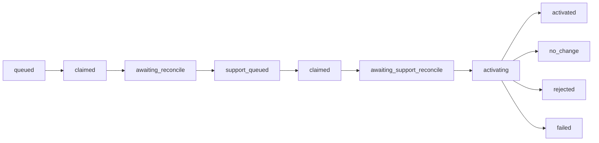

# Native taxonomy learning

Codex and Claude Code can generate and refine taxonomies through a subagent
in the active host conversation: no external model API key, standalone host
CLI, or second login required. This page explains when learning triggers, how
a job runs, and why a bad worker cannot corrupt your taxonomy.

## 📈 What triggers learning

Every successful lifecycle hook reconciles existing jobs and checks the
project/task-group thresholds:

| Stage | Default threshold |
|---|---:|
| First taxonomy generation | 5 eligible episode traces |
| First refinement review | 10 traces after activation |
| Later refinement reviews | Every 20 new traces |

!!! note "Missed triggers repair themselves"
    Polling is idempotent. If a Stop or SessionEnd event persisted a trace
    but the original trigger was interrupted, the next hook repairs the
    missed trigger.

## 🔁 Job lifecycle

1. AdaMAST freezes the exact trace references and source taxonomy version.
2. A `UserPromptSubmit` or supported `SessionStart` boundary claims the job
   with a time-bound token; on Claude Code, `SubagentStop` is a third claim
   boundary. Codex installs `SessionStart` for startup, resume, and context
   compaction so long-running desktop tasks have a second supported dispatch
   path.
3. The main host agent launches one taxonomy-generator subagent in the
   background and continues the user's task immediately. It does not wait,
   join, or poll for the worker.
4. The subagent reads `prompt.txt` and `output.schema.json`, then returns one
   bounded receipt through `SubagentStop`.
5. Foreground reconciliation validates the claim, snapshot hash, candidate
   structure, and every exact evidence quote.
6. For a replacement, a separately claimed support-review subagent decides
   whether every code is semantically supported by the cited traces. A
   `no_change` refinement skips this phase because it changes no taxonomy
   data. Codex does not claim this second phase from `SubagentStop`; it waits
   for the next supported context boundary so the launch directive cannot be
   hidden.
7. A supported candidate is registered and activated atomically at the idle
   boundary. Failure leaves MAST or the current taxonomy active.

After activation, the selector choice remains only the conversation's lineage
seed. A conversation that selected MAST still records MAST as its root, but
host context names the generated or refined taxonomy (display name plus
immutable ID) as active. Checkpoints must use codes from that active
taxonomy.

!!! note "One branch, one lineage"
    Each job snapshot belongs to exactly one conversation branch. Only that
    conversation's traces are eligible. Refinement is pinned to the branch's
    exact current taxonomy ID; an accepted replacement gets a new ID and
    creates one parent-to-child edge for that branch. Other conversations
    seeded from the same parent can create different children without sharing
    traces or changing one another's active head.

## 🚧 Worker boundary

Each taxonomy subagent may read only its phase-specific frozen prompt and
schema. It must not:

- browse the repository or network;
- inspect credentials;
- edit files or activate a taxonomy;
- invoke `codex exec`, `claude -p`, or another taxonomy agent;
- perform the user's main task.

Replacement codes must cite supporting frozen trace IDs, include a verbatim
span from every cited trace, and include a rationale. The coordinator
verifies each normalized quote against the immutable snapshot and records the
result per code. A `no_change` refinement returns an empty code list and
preserves the current taxonomy verbatim.

!!! note "How many codes?"
    Native replacements contain one to 30 codes. The 15-to-30 guidance used
    by the research refinement prompt is a generation target, not a runtime
    minimum; smaller evidence-grounded taxonomies remain valid.

That evidence is retained for validation and audit. The runtime-facing code
definition remains its ID, name, description, and category.

## 📣 Visible notices

The originating conversation receives exactly-once notices when generation or
refinement is triggered, when a replacement reaches independent support
review, and when it finishes. A finish notice may appear on the next
lifecycle event if the host cannot inject output into an idle conversation.

## 🛟 Recovery

| If… | Then… |
|---|---|
| a claim expires | it returns to the queue for a later task |
| a duplicate hook fires | it cannot queue a second active job for the same branch |
| a different conversation or host tries | it cannot claim the branch's job |
| Claude Code background tasks are disabled | the job remains queued rather than running in the foreground or blocking the conversation |
| a refinement candidate went stale because its parent taxonomy changed | it is rejected |
| a receipt is malformed | it is ignored and reported; it cannot update the store |
| legacy detached-worker jobs exist | they are retired before the native path queues a replacement from the persisted evidence |

Use `adamast status` to inspect the active taxonomy, trace counts, and
learning state.

## ➡️ Continue with

- [Codex](CODEX.md) or [Claude Code](CLAUDE_CODE.md): the host-specific
  install, selector, and event contracts.
- [Troubleshooting](TROUBLESHOOTING.md): when a job remains queued or a
  worker cannot launch.
