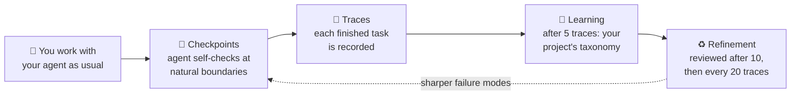

# Runtime integration

<p align="center">
  <b>Your agent keeps making the same mistakes. AdaMAST learns what they are from your agent's own work and reminds it at the right moments.</b>
</p>

<p align="center">
  <br>
</p>

**AdaMAST** rides along with the agent you already use (Codex, Claude Code, or your own harness). While the agent works, AdaMAST quietly checks the work at natural boundaries, records evidence when something goes wrong, and, after enough completed tasks, **learns a failure-mode catalog (a "taxonomy") specific to your project**. From then on, the agent is checked against *its own* known weaknesses instead of a generic list.

**Paper:** [Fantastic Adaptive Taxonomies and How to Use Them](https://arxiv.org/abs/2607.16387)

---

## 🚀 Quickstart (zero configuration)

Requirements: Python 3.10+ and Codex or Claude Code.

```bash
pip install adamast
```

Then register AdaMAST with the host you use (once):

```bash
# Claude Code
adamast claude install --user-level

# Codex
adamast codex install --user-level
```

Fully quit and reopen Codex / Claude Code, then start a **new conversation**. That's it: no config file, no extra API key, no second login.

On your first message, AdaMAST opens its taxonomy picker and asks one question: where should this conversation start from?

| Choice | What it means |
|---|---|
| 🧭 **MAST** *(recommended at first)* | Start from the built-in 14 general failure modes. After **5 completed tasks**, AdaMAST automatically learns a taxonomy specific to your project. |
| 📚 **A stored taxonomy** | Reuse a taxonomy your project already learned. |
| 🚫 **No taxonomy** | AdaMAST stays completely out of this conversation. |

Pick with one click (or one number in a terminal), and your held message continues automatically.

> 💡 **Check it worked:** run `adamast doctor` any time. It validates your install and tells you exactly what to do if something is off.

## 🔄 What happens while you work



1. **You work normally.** AdaMAST never takes over the task.
2. **At checkpoints** (finishing a sub-task, a failed tool, the final answer) the agent privately asks itself: *what just happened, what caused it, does a known failure mode apply, continue or repair?* Finding nothing wrong is a perfectly valid answer.
3. **Each completed task becomes a trace.** Traces are the raw material for learning.
4. **At 5 traces, learning kicks in.** A background worker drafts a taxonomy of *your* project's actual failure patterns, with verbatim evidence for every code. A separate reviewer must approve it before it activates. Your conversation never waits.
5. **It keeps improving.** The taxonomy is reviewed against new traces after 10 more, then every 20.

Watch it live: the hosts open the local monitor automatically. To open it manually, run `adamast dashboard --trace-output <program-dir>` ([Live monitor](DASHBOARD.md) has the interactive-store paths); it shows every checkpoint, the evidence behind it, and which failure modes fired.

## 🎛️ Make it yours

Everything above ran on defaults. Each step has one obvious knob when you want a custom setup:

| I want to… | Do this instead |
|---|---|
| Enable AdaMAST for **one repository** only | `adamast claude install --project-dir .` (same for `codex`) · [Runtime overview](GETTING_STARTED.md) |
| Start every conversation from a taxonomy I already trust | `--inherit <taxonomy-id>` at install · [Taxonomies](TAXONOMIES.md) |
| Learn faster / slower | `--generation-threshold N` (default 5), `--k-init N` (10), `--k N` (20) |
| Freeze the taxonomy (no more learning) | `--freeze` |
| Use a provider API for learning instead of native subagents | `--learning-backend provider --adamast-model <model>` · [Providers](PROVIDERS.md) |
| Build a taxonomy from traces I already have | `adamast import-traces --traces ./my_traces --adamast-model <model>` · [Trace formats](TRACE_FORMATS.md) |
| Wrap a single LLM call instead of a whole host | `adamast single-run` · [Single LLM](SINGLE_LLM.md) |
| Put AdaMAST inside my own agent loop | `from adamast import start_session` · [Runtime API](INTEGRATION.md) |

Every field, flag, and default lives in the [Configuration reference](CONFIGURATION.md); deeper customization (prompts, gates, custom hooks) in [Customization](CUSTOMIZATION.md).

## 🧠 Why adaptive taxonomies?

Improvement needs feedback that preserves *why* something failed. Scalar rewards throw the reason away; free-form reflection doesn't aggregate; a fixed catalog can't know your agent's roles, tools, or domain in advance. AdaMAST learns a compact, evidence-grounded failure vocabulary from the target system's own traces, starting from the built-in 14-code adaptation of MAST (["Why Do Multi-Agent LLM Systems Fail?"](https://arxiv.org/abs/2503.13657), Cemri et al., 2025) until the first learned taxonomy activates.

Learned codes are organized on three stable axes:

| Axis | Scope | Example |
|---|---|---|
| ⚙️ System-level | Can arise in any agent system | Context exhaustion |
| 🎭 Role-specific | Tied to a discovered component role | Checker rubber-stamps solver output |
| 🧪 Domain-specific | Requires task knowledge | Algorithm mismatch |

## 🏆 Results

| Experiment | Headline |
|---|---|
| OfficeQA Pro | 44.4% → **51.9%** official scorer, same 133-question harness in both arms |
| Circle packing, n=26 | AdaMAST-guided search reaches **0.997×** the AlphaEvolve record in 20 evaluations |
| TRAIL (paper) | Induced codes align with expert annotations at Cohen's κ **0.725** |
| Terminal-Bench 2.0 (paper) | AdaMAST-Judge at **89.9%** accuracy |
| Evolutionary optimization, 655 problems (paper) | **87.9% → 91.9%** held-out improvement |

The rows marked *(paper)* are documented in the
[paper](https://arxiv.org/abs/2607.16387). The OfficeQA and circle-packing
rows come from the maintainers' evaluation archive; per-question rows and raw
scorer output are not published, so those headline numbers cannot be
independently recomputed.

## 📚 Learn more

| You want to… | Read |
|---|---|
| Do the first install, step by step | [Interactive setup](INTERACTIVE_SETUP.md) |
| See one complete run end to end | [Example run](EXAMPLE_RUN.md) |
| Understand the words (gate, trace, taxonomy, …) | [Concepts](CONCEPTS.md) |
| Understand how learning stays safe & race-free | [Native taxonomy learning](NATIVE_LEARNING.md) |
| Fix a broken setup | [Troubleshooting](TROUBLESHOOTING.md) |
| Browse everything | [Documentation home](index.md) |

<details>
<summary><b>🧰 Runtime commands</b></summary>

| Command | Purpose |
|---|---|
| `adamast doctor` | Validate paths, configuration, hooks, and host contracts |
| `adamast status` | Show the active taxonomy, traces, learning state, recent decisions |
| `adamast find` | List or select stored taxonomies |
| `adamast dashboard` | Open the local taxonomy dashboard / checkpoint monitor |
| `adamast traces` | Inspect trace state |
| `adamast import-traces` | Generate a taxonomy from existing traces |
| `adamast claude install` / `uninstall` | Manage Claude Code hooks |
| `adamast claude add-hook` / `remove-hook` / `list-hooks` | Manage custom Claude Code checkpoint hooks |
| `adamast codex install` / `uninstall` | Manage Codex hooks |
| `adamast claude checkpoint` / `adamast codex checkpoint` | Record a private runtime checkpoint (invoked by the hooks) |
| `adamast single-run` | Wrap one direct model task with AdaMAST |

The standalone verbs (`generate`, `judge`, `validate`, `normalize`, `view`,
`register-taxonomy`) are covered from the [documentation home](index.md)
onward, in the Foundation and Evaluation guides.

</details>
