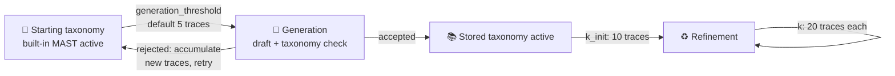

# Traces and learning lifecycle

This page explains when your working sessions become traces, when accumulated
traces trigger taxonomy learning, and the fields that control each threshold.

AdaMAST separates runtime interaction from taxonomy learning. Runtime
checkpoints (the reflection boundaries also called gates) help the current
task avoid repeated mistakes. Learning uses completed traces to generate or
refine taxonomies for future tasks.

## 🗺️ The lifecycle at a glance



## 🧾 What counts as a trace

The general definition and the accepted file formats live in
[Prepare traces](TRACE_FORMATS.md#what-counts-as-a-trace); this section
defines the episode-level contract used by live integrations.

| Integration | One trace is… |
| --- | --- |
| Batch integrations | One launched task's canonical trajectory (the existing task-level contract) |
| Codex and Claude Code conversations | One **episode**: a substantive user turn, the main agent's work, and its final Stop boundary |

Episode details:

- Follow-up requests in the same conversation are separate episodes.
- The stored trajectory is the transcript delta since the previous committed
  Stop, not a repeated copy of the entire conversation.
- Claude Code can use its blocking reflection loop. Codex commits a compact
  `Checkpoint`/`Relevant codes`/`Evidence`/`Next action` block in one callback
  because a continued Codex Desktop turn is not guaranteed to redeliver Stop.
- Incomplete interactive episodes are recovered on resume or the next
  substantive prompt, and user-only abandoned turns do not become learning
  traces.
- Sub-task and subagent checkpoints contribute runtime evidence but do not
  create extra generation traces by default.
- Empty sessions and AdaMAST control turns are not learning traces.

!!! note "What each host stores"
    Codex persists a bounded normalized JSONL view rather than the raw harness
    transcript. It retains human/assistant messages and tool interactions while
    excluding developer context, reasoning, hook prompts, installed-skill
    reads, and accounting events. Claude Code keeps its existing adapter
    transcript contract.

See [Interactive setup](INTERACTIVE_SETUP.md) for the user workflow and
[Architecture](ARCHITECTURE.md) for the current project, conversation, and
host-isolation design.

## 📂 Trace output is mandatory

Every run needs a trace output. This gives AdaMAST a stable folder for the task
or program even before a generated taxonomy exists.

For example:

```json
{
  "trace_output": "./adamast-program"
}
```

## 🌱 The starting taxonomy (MAST)

When no taxonomy is inherited, AdaMAST starts with built-in MAST.

After `generation_threshold` traces accumulate, AdaMAST can start taxonomy
generation. The default threshold is `5`.

```json
{
  "generation_threshold": 5,
  "generation_stops": false
}
```

| `generation_stops` | Behavior |
| --- | --- |
| `false` | Already-running tasks continue with MAST while generation happens. The generated taxonomy activates only after running tasks finish. |
| `true` | The task waits until generation finishes. |

!!! note "Codex native learning"
    For interactive Codex use, `codex.learning_backend: "codex_subagent"`
    freezes the exact threshold-crossing episode set and queues a native
    in-task subagent. Each lifecycle hook polls for missed threshold triggers,
    so repeated checks are safe and an interrupted trigger is repaired on the
    next event. Later episodes cannot change that worker's evidence. They
    continue on the current taxonomy and are retained for the next refinement
    window.

## ✅ Accepted vs rejected generation

Generated taxonomies must pass the configured taxonomy check unless
`skip_judge` is enabled.

If the generated taxonomy is rejected or generation fails, the starting-period traces stay
in the program folder. They are not moved into a taxonomy trace folder until a
valid taxonomy is accepted.

After rejection, AdaMAST waits until enough new traces have accumulated
relative to the rejected snapshot, then generation can run again over the
accumulated traces.

## 🔁 Refinement counters

Once a real stored taxonomy is active, each program tracks its own refinement
counter.

Defaults:

```json
{
  "k_init": 10,
  "k": 20,
  "refinement_stops": false
}
```

- `k_init`: traces required before the first refinement for that program and
  taxonomy.
- `k`: traces required after each later refinement.

If a taxonomy is refined, the accepted candidate gets a new `taxonomy_id`. The
publishing program counter resets. Other programs preserve their independent
counters.

!!! note
    Native refinement consumes only the frozen trace references it reviewed.
    Traces completed while the worker was running remain counted. The worker
    may return `no_change`; that advances the review cadence without creating
    a successor. Native successors activate only for the originating
    project/task group rather than silently advancing unrelated programs.

## 🧪 Advanced refinement

```json
{
  "advanced_refinement": false
}
```

Standard refinement proposes a refined taxonomy and records a structural diff.

Advanced refinement adds one support-judge repair pass. If issues are found,
the refinement model gets the judge output and proposes one repaired taxonomy.
The repaired taxonomy is accepted automatically after that single repair pass.

!!! note
    Every refinement artifact also includes non-blocking overlap warnings.
    These warnings flag pairs of failure modes whose names/descriptions look
    unusually similar. They are meant for review, not automatic rejection.

## 🧊 Freeze mode

For clean A/B evaluations, turn on inference-only mode:

```json
{
  "freeze": true
}
```

Freeze mode still records runtime evidence and traces. It skips both MAST
first-generation and stored-taxonomy refinement, so the active taxonomy stays
pinned for the run.

## 📤 Evidence export

AdaMAST always keeps runtime evidence in the program folder. If you also want a
durable snapshot for an external dashboard or archive, set `evidence_export`:

```json
{
  "evidence_export": "./adamast-evidence"
}
```

If the value ends in `.json`, AdaMAST writes exactly that file. Otherwise AdaMAST
treats it as a directory and writes one `<program_id>.json` snapshot inside it
at session end. Exporting never moves or deletes the original trace/evidence
files.

## 📒 Usage ledger

Program manifests include a small usage ledger for learning calls. The ledger
counts AdaMAST generation, judge, and refinement calls and records the stage and
model used. When the provider does not expose token or cost metadata, AdaMAST
marks the event as `usage_available: false` instead of estimating.

Use `adamast status --config adamast.json` to see the current totals.

## 🧹 Trace retention

AdaMAST keeps accumulated traces by default. If you run many long tasks, trace
folders can grow large.

!!! tip
    Keep trace roots outside the repository and periodically archive or prune
    old program folders that are no longer needed for learning.

## ➡️ Continue with

- [Taxonomy lifecycle](TAXONOMIES.md): the records, IDs, and lineage the
  learning steps produce.
- [Native taxonomy learning](NATIVE_LEARNING.md): how Codex and Claude Code
  run these triggers in the host conversation.
