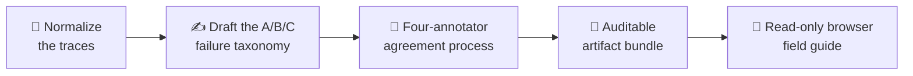

# AdaMAST documentation

On this page you will install AdaMAST and generate your first failure-mode
taxonomy — a catalog of the ways your agent actually fails, learned from its
own traces. Two commands and one provider credential are all it takes.

AdaMAST builds failure-mode taxonomies from agent traces (recorded task
transcripts), checks that independent annotators can apply them consistently,
and reuses the result for evaluation or runtime guidance. The documentation
runs from the smallest standalone workflow to the most involved integration —
you do **not** need Codex, Claude Code, or an agent harness to generate a
taxonomy or judge a trace.

## 📦 Install AdaMAST

You need:

- Python 3.10 or newer
- a JSON or JSONL trace file, or a directory containing those files
- credentials for one supported model provider when running generation or a
  model-backed judge

1. Install from PyPI:

    ```bash
    pip install adamast
    ```

2. Verify the installation (this performs no model calls):

    ```bash
    adamast --help
    python -m adamast.examples
    adamast validate adamast-examples/traces.jsonl
    ```

    The first command copies the bundled example files into
    `./adamast-examples/` so they work from any install.

    The validation command reports the trace count, detected formats, input
    files, and empty trajectories.

!!! note "Make it yours"
    The standard installation already includes the OpenAI adapter used in the
    first example. Anthropic, Google, and AWS Bedrock are optional provider
    installs — see [Providers and models](PROVIDERS.md). Source and
    contributor installations are kept in the
    [installation reference](INSTALLATION.md).

## 🧪 Generate your first taxonomy

1. Set one provider credential. This example uses OpenAI; the same workflow
   supports Anthropic, Google, and AWS Bedrock:

    ```bash
    export OPENAI_API_KEY="..."
    ```

2. Run generation on the bundled example traces:

    ```bash
    adamast generate \
      --provider openai \
      --model gpt-5-nano \
      --traces adamast-examples/traces.jsonl \
      --output ./my-taxonomy \
      --view
    ```

That one command runs the whole pipeline:



| Make it yours | Read |
|---|---|
| Bring your own trace data | [Prepare traces](TRACE_FORMATS.md) |
| Your trace file already validates | Go directly to [Generate a taxonomy](BASELINE_GENERATION.md) |
| Use Anthropic, Google, or AWS Bedrock instead of OpenAI | [Providers and models](PROVIDERS.md) |

## 🧭 Choose a workflow

| Level | Goal | Start with |
| --- | --- | --- |
| **01 · Foundation** | Generate and agreement-check a standalone taxonomy from completed traces | [Prepare traces](TRACE_FORMATS.md) |
| **02 · Evaluation** | Apply a taxonomy to new traces or select a specialized judge | [Judge traces](JUDGING.md) |
| **03 · Adaptive runtime** | Accumulate traces and refine the active taxonomy over time | [Runtime overview](GETTING_STARTED.md) |
| **04 · Host integration** | Install the adaptive runtime into Codex or Claude Code | [Codex](CODEX.md) or [Claude Code](CLAUDE_CODE.md) |

## 🧠 Core concepts

Three names appear on every page:

| Name | Meaning |
|---|---|
| **BASELINE** | The standalone generation path. It takes completed traces, creates a taxonomy, and runs the full inter-annotator agreement layer. It installs no hooks and keeps no runtime state. |
| **JUDGES** | Applies an existing taxonomy to new evidence. The core judge returns one validated, evidence-backed failure code per trace; specialized judges cover mapping, coverage, taxonomy quality, calibration, and causal reflection. |
| **Adaptive runtime** | Records new traces, keeps a taxonomy active at task boundaries, and starts generation or refinement when configured thresholds are reached. Single-model programs and custom harnesses come before the host-specific Codex and Claude Code installers. |

The full glossary — taxonomy, trace, checkpoint, judge, program — lives in
[Choose a workflow](CONCEPTS.md).

## 📚 What to read next

| Question | Read |
|---|---|
| Which input shapes are accepted, and what is the canonical normalized record? | [Trace formats](TRACE_FORMATS.md) |
| How do the four annotators, Fleiss kappa, coverage, and `review_required` results work? | [Agreement gate](AGREEMENT_GATE.md) |
| How do I set credentials and pick models for OpenAI, Anthropic, Google, and Bedrock? | [Providers and models](PROVIDERS.md) |
| What are `taxonomy.json`, the manifest, the intermediate artifacts, and the browser field guide? | [Taxonomy outputs](TAXONOMY_OUTPUTS.md) |

The research method and evaluation are described in
[Fantastic Adaptive Taxonomies and How to Use Them](https://arxiv.org/abs/2607.16387).

Continue with [Prepare traces](TRACE_FORMATS.md) to start Level 01, or with
[Choose a workflow](CONCEPTS.md) if you want the full map first.
